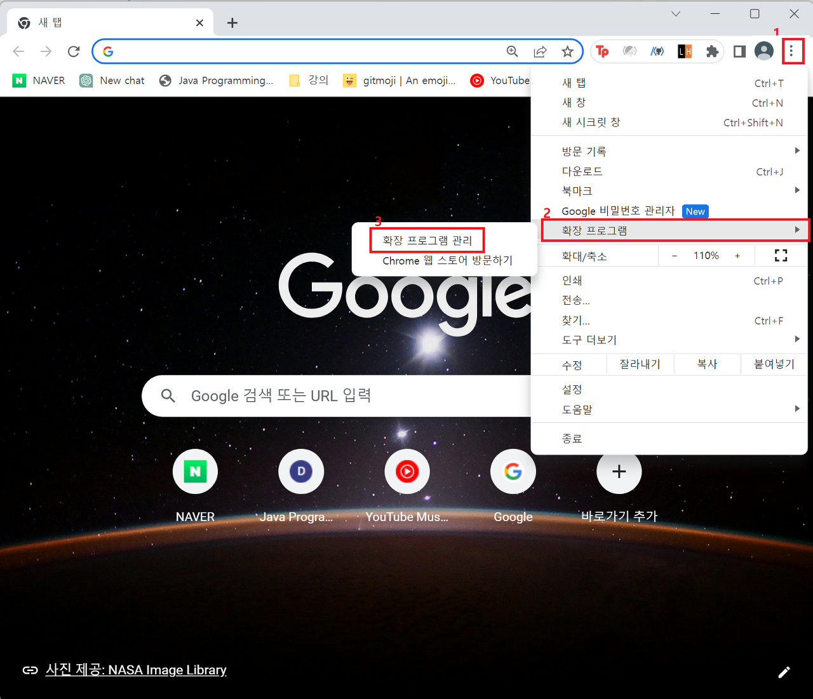

## 설명

리트허브를 백준허브의 디렉토리 및 커밋 포맷으로 커스터마이징한 레포입니다.<br>
리트코드 코드 제출 시 자동으로 싱크를 맞춘 레포에 자동으로 커밋합니다.<br>
단, 반드시 리트코드의 **old version**을 사용하셔야 합니다.<br>
다음과 같은 디렉토리 구조로 코드가 올라가게 됩니다.

```
└─LeetCode
   ├─Easy
   │  ├─0001-two-sum
   │  ├─0136-single-number
   │  └─0169-majority-element
   └─Medium
       ├─0074-search-a-2d-matrix
       ├─0079-word-search
       ├─0128-longest-consecutive-sequence
       ├─0179-largest-number
       ├─0279-perfect-squares
       ├─0473-matchsticks-to-square
       └─0873-length-of-longest-fibonacci-subsequence

```

## 수정한 점

- 디렉토리 구조 변경
- 커밋 개수 변경
- 커밋 포맷 변경

## 사용 방법

1. 해당 레포지터리를 `git clone` 받습니다.
2. 크롬 익스텐션에서 개발자 모드 > 앱축해제된 확장 프로그램 로드 > 해당 프로젝트 디렉토리 로드
   
   
